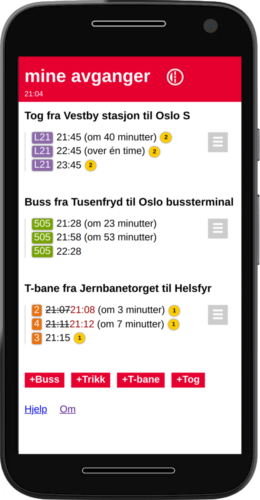

# mine avganger - personlig avgangstavle som en webapp

*For English readers: this README is written in Norwegian, since the webapp
primarily is intended for a Norwegian audience. However, all the code is written
in English.*

Eksperiment/eksempel/demo på bruk av Entur.org JourneyPlanner API for å lage min
egen personlige avgangstavle for kollektivreiser i Norge. I form av en enkel og
tilstandsløs webapplikasjon. All kode er JavaScript/HTML og applikasjonen
trenger ingen backend annet enn Enturs åpent tilgjengelige API-er.

Applikasjonen kan installeres som en PWA-app på mobile enheter.

## Motivasjon

1. Ruter.no fjernet mulighet for å lagre favoritt-avganger på nettsidene sine.
   Jeg pendler og trenger stadig oppdatert informasjon om de samme avgangene,
   hver dag.
  
2. Rask tilgang til sanntidsinformasjon når jeg er på farten, og bare for
   avgangene jeg bruker, i en kompakt form, uten at jeg må installere en
   mobilapp for *det også*.

3. Utforske Entur.org sitt JourneyPlanner API og GraphQL.

4. Utforske Progressive Web Apps (PWA) på mobile enheter.

## Hvor

https://mineavganger.no/

## Bruk

1. Endre og tilpass, kopier filene til en web-server/hosting-løsning.

2. Ferdig; du har nå appen på ditt eget nettsted.

Alternativt serves også appen <a href="https://mineavganger.no/">herfra</a>.

## Avhengigheter

1. Entur.org åpent JourneyPlanner API: https://api.entur.io/journey-planner/v2/graphql

2. Entur.org åpent Geocoder API: https://api.entur.io/geocoder/v1/autocomplete

3. JQuery og jQuery.autocomplete (inkludert)

4. Et sted å serve web-ressursene fra.

5. En nettleser/mobil.

## Utvikling

Dersom du synes applikasjonen er nyttig må du gjerne fortelle om det. Og du kan
selvfølgelig rapportere om feil/mangler her, eller lage en pull-request som
løser problemet. 

### TODO

- Animere endringer i avgangslisten.
- Mulighet for eksportere avganger som URL som kan deles.
- Sjekke om det finnes avganger før bruker trykker "legg til".
